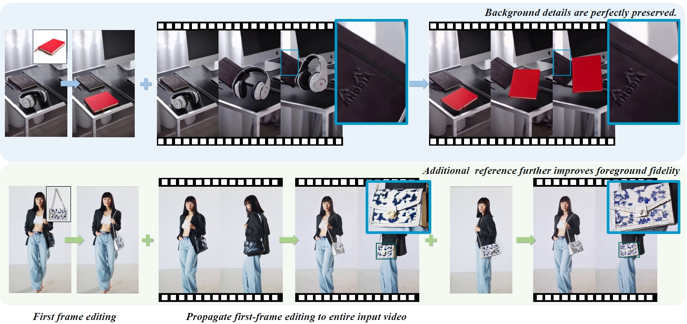

# LoRA-Edit: Controllable First-Frame-Guided Video Editing via Mask-Aware LoRA Fine-Tuning

[[Paper]](https://arxiv.org/pdf/2506.10082) | [[Project Page]](https://cjeen.github.io/LoraEditPaper/) | [[Demo]](https://www.youtube.com/watch?v=xOUnpG7hqL8)

<div align="center">
  
</div>
We achieves high-quality first-frame guided video editing given a reference image (top row), while maintaining flexibility for incorporating additional reference conditions (bottom row).

## 📰 News

- **[2025.06.15]** Additional edited frames as guidance is now available! 🎉
- **[2025.06.07]** LoRA-Edit first-frame-guided-editing code is now available! 🎉

## Important Notes

1. Unlike video editing techniques such as VACE, our method itself does not provide visual editing capabilities. Instead, we leverage powerful image editing models to edit the first frame (or more frames), thereby transferring image editing capabilities to video editing.

2. Our project currently runs at a moderate speed, taking 30-50 minutes to edit 49 frames on RTX 4090. We are actively working on optimizations (A faster version will be available this month).

3. The ComfyUI version is currently facing challenges as we haven't found a suitable node for training Wan I2V LoRA in ComfyUI.

4. We welcome your issues and contributions to our project!

## TODO List

- [x] Upload first-frame-guided video editing code (Completed)
- [x] Upload additional reference code (~~Expected before UTC 2025.06.15~~, Completed)
- [x] Upload detailed memory and speed report on RTX 4090 (~~Expected before UTC 2025.06.15~~, Completed)
- [ ] Optimize memory usage and speed

## 🛠️ Environment Setup

### Prerequisites
- CUDA-compatible GPU with sufficient VRAM (We use a single GeForce RTX 4090 (24GB))
- Python 3.12 (recommended)
- Git
- Miniconda or Anaconda

### 1. Clone Repository and Setup Environment

```bash
# Clone the repository with submodules
git clone --recurse-submodules https://github.com/cjeen/LoRAEdit.git
cd LoRAEdit

# If you already cloned without submodules, run:
# git submodule init
# git submodule update
```

### 2. Install Miniconda (if not already installed)

Download and install from: https://docs.anaconda.com/miniconda/

### 3. Create Conda Environment

```bash
# Create environment with Python 3.12
conda create -n lora-edit python=3.12
conda activate lora-edit
```

### 4. Install PyTorch

**Important**: Install PyTorch 2.6.0 with CUDA 12.4 for flash attention compatibility:

```bash
pip install torch==2.6.0 torchvision==0.21.0 torchaudio==2.6.0 --index-url https://download.pytorch.org/whl/cu124
```

### 5. Install NVCC

Install nvcc to match your CUDA version: https://anaconda.org/nvidia/cuda-nvcc

```bash
conda install -c nvidia cuda-nvcc
```

### 6. Install Dependencies

```bash
# Install Python dependencies
pip install -r requirements.txt
```

### 7. Install SAM2

```bash
# Clone and install SAM2
git clone https://github.com/facebookresearch/sam2.git
cd sam2
pip install -e .
cd ..
```

### 8. Download Models

#### Download Wan2.1-I2V Model
```bash
# Install huggingface_hub if not already installed
pip install huggingface_hub

# Download the Wan2.1-I2V model
huggingface-cli download Wan-AI/Wan2.1-I2V-14B-480P --local-dir ./Wan2.1-I2V-14B-480P
```

#### Download SAM2 Model Checkpoint
```bash
# Create models directory
mkdir -p models_sam

# Download SAM2 large model (recommended)
wget https://dl.fbaipublicfiles.com/segment_anything_2/072824/sam2_hiera_large.pt -O models_sam/sam2_hiera_large.pt

# Alternative: Download other SAM2 models if needed
# SAM2 Base+: wget https://dl.fbaipublicfiles.com/segment_anything_2/072824/sam2_hiera_base_plus.pt -O models_sam/sam2_hiera_base_plus.pt
# SAM2 Small: wget https://dl.fbaipublicfiles.com/segment_anything_2/072824/sam2_hiera_small.pt -O models_sam/sam2_hiera_small.pt
# SAM2 Tiny: wget https://dl.fbaipublicfiles.com/segment_anything_2/072824/sam2_hiera_tiny.pt -O models_sam/sam2_hiera_tiny.pt
```

## 🚀 Usage
### Tutorial Video

Watch this quick tutorial to see how to use the data preprocessing interface:

https://github.com/user-attachments/assets/a03ee16a-c816-4284-8f45-a3cbbed4c702

*Note: A new tutorial video covering additional reference frames will be available soon.*

### Step 1: Data Preprocessing

Launch the data preprocessing interface:

```bash
python predata_app.py --port 8890 --checkpoint_dir models_sam/sam2_hiera_large.pt
```

### Step 2: LoRA Training

After preprocessing, use the generated training command (example):

```bash
NCCL_P2P_DISABLE="1" NCCL_IB_DISABLE="1" deepspeed --num_gpus=1 train.py --deepspeed --config ./processed_data/your_sequence/configs/training.toml
```

#### 🏁 Training Cost

The table below summarizes the training speed and memory usage for different numbers of frames at 480P (832×480) resolution on an RTX 4090, helping you estimate the resource requirements for your own experiments.  
All results on our [project page](https://cjeen.github.io/LoraEditPaper/) are obtained by training for 100 steps under the 49-frame setting at 480P (832×480).

| Number of Frames | Time per Iteration (sec) | Memory Usage (MB) |
|:---------------:|:------------------------:|:-----------------:|
|        5        |          7.55            |     11,086        |
|       13        |         10.81            |     12,496        |
|       21        |         14.79            |     14,456        |
|       49        |         31.88            |     21,522        |
|     65&nbsp;†   |         45.71            |     20,416        |

<sup>† For 65 frames, <code>blocks_to_swap</code> was set to 38 instead of the default 32.</sup>

### Step 3: Video Generation

After training completes, run inference:

```bash
# Save your edited first frame as edited_image.png (or .jpg) in the data directory
# Then run inference
python inference.py --model_root_dir ./Wan2.1-I2V-14B-480P --data_dir ./processed_data/your_sequence
```

### Step 4: Additional Edited Frames as Reference (Optional)

For more precise control using multiple edited frames as reference:

```bash
# 1. Put your edited frames from source_frames to additional_edited_frames directory
# Edit frames from ./processed_data/your_sequence/source_frames/
# Save edited frames to ./processed_data/your_sequence/additional_edited_frames/
# Important: Keep the same filename (e.g., 00000.png, 00001.png, etc.)

# 2. Preprocess additional data
python predata_additional.py --data_dir ./processed_data/your_sequence

# 3. Train additional LoRA (much faster than previous LoRA training)
NCCL_P2P_DISABLE="1" NCCL_IB_DISABLE="1" deepspeed --num_gpus=1 train.py --deepspeed --config ./processed_data/your_sequence/configs/training_additional.toml

# 4. Run inference with additional frames guidance
python inference.py --model_root_dir ./Wan2.1-I2V-14B-480P --data_dir ./processed_data/your_sequence --additional
```

## 📁 Directory Structure

```
project_root/
├── predata_app.py          # Data preprocessing interface
├── train.py                # LoRA training script
├── inference.py            # Video generation inference
├── models_sam/             # SAM2 model checkpoints
│   └── sam2_hiera_large.pt
├── Wan2.1-I2V-14B-480P/    # Wan2.1 model directory
├── processed_data/         # Processed training data
│   └── your_sequence/
│       ├── source_frames/  # Original frames for editing
│       ├── additional_edited_frames/  # Your edited frames for additional reference
│       ├── traindata/      # Training videos and captions
│       ├── configs/        # Training configuration files
│       ├── lora/          # Trained LoRA checkpoints
│       ├── inference_rgb.mp4    # Preprocessed RGB video
│       ├── inference_mask.mp4   # Mask video
│       └── edited_image.png     # Your edited first frame
└── requirements.txt
```

## 🙏 Acknowledgments

We would like to express our sincere gratitude to [Wan2.1](https://github.com/Wan-Video/Wan2.1) for open-sourcing their powerful Image-to-Video model, which serves as the foundation for our work.

This project is built upon [diffusion-pipe](https://github.com/tdrussell/diffusion-pipe) by tdrussell. We gratefully acknowledge their excellent work in providing a solid foundation for memory-efficient training of diffusion models.

The SAM2 GUI interface in this project references code from [SAM2-GUI](https://github.com/YunxuanMao/SAM2-GUI) by YunxuanMao. We thank them for their contribution to the SAM2 community with their intuitive interface design.
